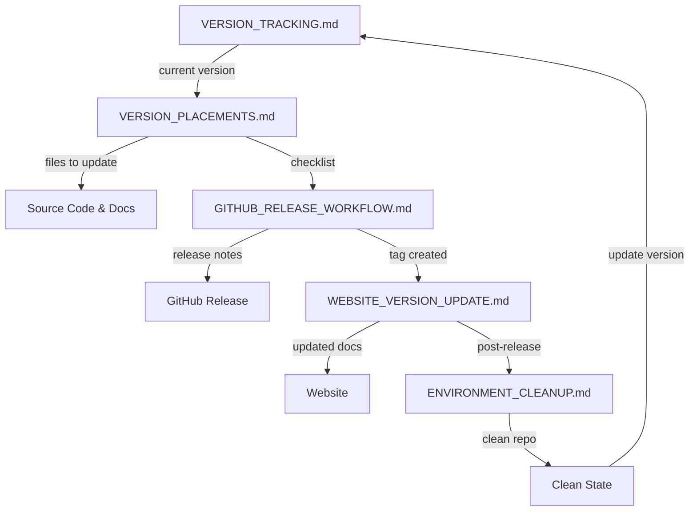

# 📁 .local/ - Automation Directory

**Purpose:** Local-only files for AI-assisted version management
**Status:** INTERNAL - DO NOT PUBLISH TO WEBSITE

---

## 📋 Directory Contents

This directory contains all automation files for managing RADS releases:

| File | Purpose | When to Use |
|------|----------|--------------|
| [VERSION_TRACKING.md](./VERSION_TRACKING.md) | Central version status and history | Always check first |
| [VERSION_PLACEMENTS.md](./VERSION_PLACEMENTS.md) | Complete inventory of version strings | When updating versions |
| [GITHUB_RELEASE_WORKFLOW.md](./GITHUB_RELEASE_WORKFLOW.md) | GitHub Actions for automated releases | When creating releases |
| [WEBSITE_VERSION_UPDATE.md](./WEBSITE_VERSION_UPDATE.md) | Website documentation update procedures | After each release |
| [ENVIRONMENT_CLEANUP.md](./ENVIRONMENT_CLEANUP.md) | Cleanup policies and automation scripts | After each release |
| [RELEASE_AUTOMATION_COMPLETE.md](./RELEASE_AUTOMATION_COMPLETE.md) | Master reference for all automation | For understanding complete workflow |

---

## 🚀 Quick Start

### For AI Assistant - New Release Workflow

```bash
# 1. Check current version
cat .local/VERSION_TRACKING.md | grep "Current Version"

# 2. Find all files to update
cat .local/VERSION_PLACEMENTS.md

# 3. Create GitHub release
cat .local/GITHUB_RELEASE_WORKFLOW.md

# 4. Update website
cat .local/WEBSITE_VERSION_UPDATE.md

# 5. Clean up
cat .local/ENVIRONMENT_CLEANUP.md
```

### For Human - Understanding System

1. Read [RELEASE_AUTOMATION_COMPLETE.md](./RELEASE_AUTOMATION_COMPLETE.md) for overview
2. Refer to specific files for detailed procedures
3. Follow checklists and use provided commands

---

## ⚠️ IMPORTANT NOTES

### NEVER Publish These Files
All files in `.local/` are INTERNAL ONLY:
- ❌ Do NOT add to website
- ❌ Do NOT include in GitHub releases
- ❌ Do NOT link from public documentation
- ✅ Only use for AI automation and human reference

### Git Ignore
Add to `.gitignore`:
```
.local/
VERSION_TRACKING.md
```

Or add to `.git/info/exclude` for local tracking without committing.

---

## 📊 Workflow Summary

```
1. VERSION_TRACKING.md
   ↓
2. VERSION_PLACEMENTS.md (find all files)
   ↓
3. GITHUB_RELEASE_WORKFLOW.md (create release)
   ↓
4. WEBSITE_VERSION_UPDATE.md (update docs)
   ↓
5. ENVIRONMENT_CLEANUP.md (clean up)
   ↓
6. VERSION_TRACKING.md (update with new version)
   ↓
[Back to 1]
```

---

## 🔍 How Files Interconnect



---

## 📝 File Maintenance

### When to Update
- **VERSION_TRACKING.md:** After every release
- **VERSION_PLACEMENTS.md:** When files are added/removed
- **GITHUB_RELEASE_WORKFLOW.md:** When GitHub Actions change
- **WEBSITE_VERSION_UPDATE.md:** When website structure changes
- **ENVIRONMENT_CLEANUP.md:** When cleanup policies change
- **RELEASE_AUTOMATION_COMPLETE.md:** When system changes significantly

### Update Checklist
- [ ] Current version correct
- [ ] All file paths accurate
- [ ] All commands tested
- [ ] All links working
- [ ] Tables and lists up to date

---

## 🎯 Common Tasks

### Task: Prepare New Version
1. Read `VERSION_TRACKING.md` → note current version
2. Decide next version (e.g., 0.0.7)
3. Choose codename (thematic)
4. Create development plan document
5. Update `VERSION_TRACKING.md` with planned version

### Task: Update All Version Strings
1. Read `VERSION_PLACEMENTS.md` → complete list
2. Use automation commands or manual search/replace
3. Verify with grep: `grep -r "0\.0\.[0-9]" .`
4. Test build and functionality

### Task: Create GitHub Release
1. Follow `GITHUB_RELEASE_WORKFLOW.md` → create tag
2. Push tag to GitHub
3. Monitor GitHub Actions
4. Verify release created

### Task: Update Website
1. Follow `WEBSITE_VERSION_UPDATE.md` → create docs
2. Verify past 5 versions present
3. Update `docs/README.md`
4. Commit and push to main (triggers gh-pages)

### Task: Clean Environment
1. Follow `ENVIRONMENT_CLEANUP.md` → run cleanup
2. Verify old files removed
3. Verify important files preserved
4. Check for any issues

---

## 🐛 Troubleshooting

### Version strings not found
- Check `VERSION_PLACEMENTS.md` for complete search patterns
- Use: `grep -r "0\.0\.[0-9]" --include="*.md" .`

### GitHub Actions failing
- Check `GITHUB_RELEASE_WORKFLOW.md` for syntax errors
- Monitor: `gh run list --workflow=release.yml`
- Review logs: `gh run view <run-id>`

### Website not updating
- Verify `gh-pages` workflow triggered
- Check deployment: `gh api /repos/zarigata/RADS/pages`
- Check live site: `curl -I https://zarigata.github.io/RADS`

### Cleanup deleted wrong files
- Check git: `git status`
- Restore: `git checkout HEAD -- <file>`
- Update cleanup script if needed

---

## 📚 Quick References

### Main Project Files
- [README.md](../README.md) - Main project documentation
- [CHANGELOG.md](../CHANGELOG.md) - Version history
- [Install Script](../install.sh) - Installation procedure

### Version Documents (Root)
- [v0.0.6 Summary](../V0.0.6_FIGHTER_JET_SUMMARY.md)
- [v0.0.5 Summary](../V0.0.5_CHAMELEON_SUMMARY.md)
- [v0.0.4 Status](../V0.0.4_STATUS.md)

### Documentation (docs/)
- [README](../docs/README.md) - Documentation hub
- [Quick Reference](../docs/V0.0.6_QUICK_REFERENCE.md)
- [Migration Guide](../docs/MIGRATION_GUIDE.md)

---

## 🔗 System Overview

This automation system ensures:

1. **Version Consistency** - All version strings tracked and updated together
2. **Automated Releases** - GitHub Actions handle release creation
3. **Documentation Accuracy** - Website updated automatically with all info
4. **Clean Repository** - Old files and artifacts removed regularly
5. **Past Version Tracking** - Last 5 versions always documented
6. **AI-Friendly** - All procedures clear and machine-readable

---

## 🎓 Best Practices

### For AI Assistants
1. **Always read VERSION_TRACKING.md first** - Understand current state
2. **Use checklists** - Don't skip steps
3. **Verify changes** - Test before committing
4. **Update documentation** - Keep files in sync
5. **Clean up** - Remove old files after releases

### For Humans
1. **Read RELEASE_AUTOMATION_COMPLETE.md** - Understand the system
2. **Follow specific file instructions** - Use detailed guides
3. **Use provided commands** - Don't reinvent the wheel
4. **Check for issues** - Verify each step
5. **Ask for help** - If procedures unclear

---

## ⚡ Future Enhancements

Potential improvements to the automation system:

1. **Automated version bumping** - Script to update all version strings
2. **Website build system** - Proper static site generator
3. **Automated testing** - CI for all platforms before release
4. **Automated deployment** - Multiple target deployments
5. **Version diff viewer** - Visual comparison of version changes
6. **Automated migration guide** - Generate from breaking changes

---

## 📝 File Format Standards

All files follow this structure:

```markdown
# 🔍 [FILE NAME]

**Purpose:** [Clear description]
**Usage:** [When to use]
**Status:** INTERNAL - DO NOT PUBLISH

---

## [Major Sections]

### [Subsections]

#### [Detail levels]

- [Checklists]
- [Commands]
- [Tables]
- [Notes]

---

**Last Updated:** [Date]
**Maintained By:** [Author/AI]
```

---

## 🎯 Success Criteria

The automation system is successful when:

- [ ] All version strings updated in one operation
- [ ] GitHub releases created automatically
- [ ] Website updates completed without errors
- [ ] Environment clean and organized
- [ ] Past 5 versions fully documented
- [ ] No manual intervention required (except initial setup)
- [ ] AI assistants can follow procedures easily
- [ ] Humans can understand and use the system
- [ ] All files up to date and accurate

---

## 📞 Support

### Questions About Automation
1. Check [RELEASE_AUTOMATION_COMPLETE.md](./RELEASE_AUTOMATION_COMPLETE.md) first
2. Refer to specific automation file for details
3. Check file comments and examples
4. Verify you're using latest version of files

### Reporting Issues
If you find bugs or issues in the automation:
1. Document the problem clearly
2. Provide steps to reproduce
3. Suggest fix if known
4. Update relevant automation file

---

**Created:** January 27, 2026
**Last Updated:** January 27, 2026
**Maintained By:** AI Assistant Automation
**Purpose:** Complete version management system for RADS releases

---

## 🎉 Summary

The `.local/` directory contains a complete, self-contained system for:

✅ **Version Tracking** - Know what version we're on
✅ **Version Placement** - Know where to update
✅ **GitHub Releases** - Automate release creation
✅ **Website Updates** - Keep documentation current
✅ **Environment Cleanup** - Keep repository clean
✅ **Master Reference** - Understand the whole system

**All files are LOCAL ONLY - Never publish to website!**
